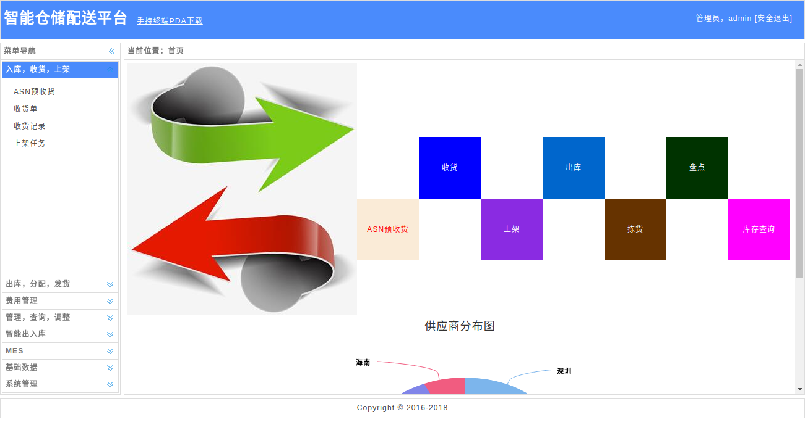
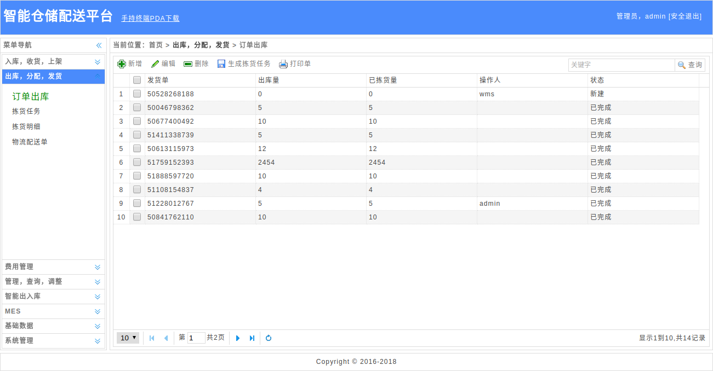
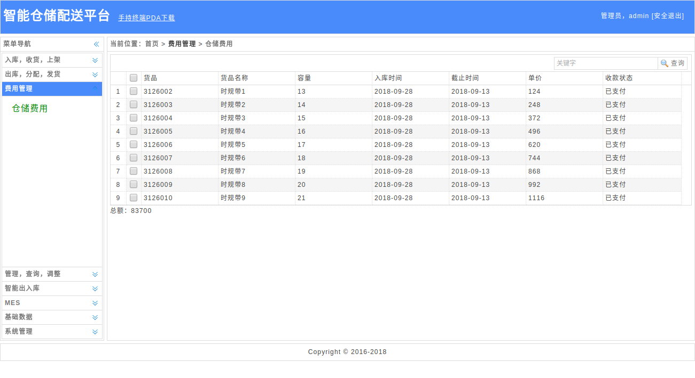
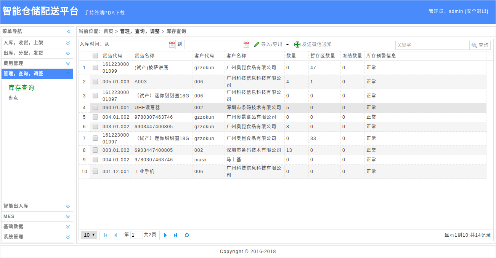
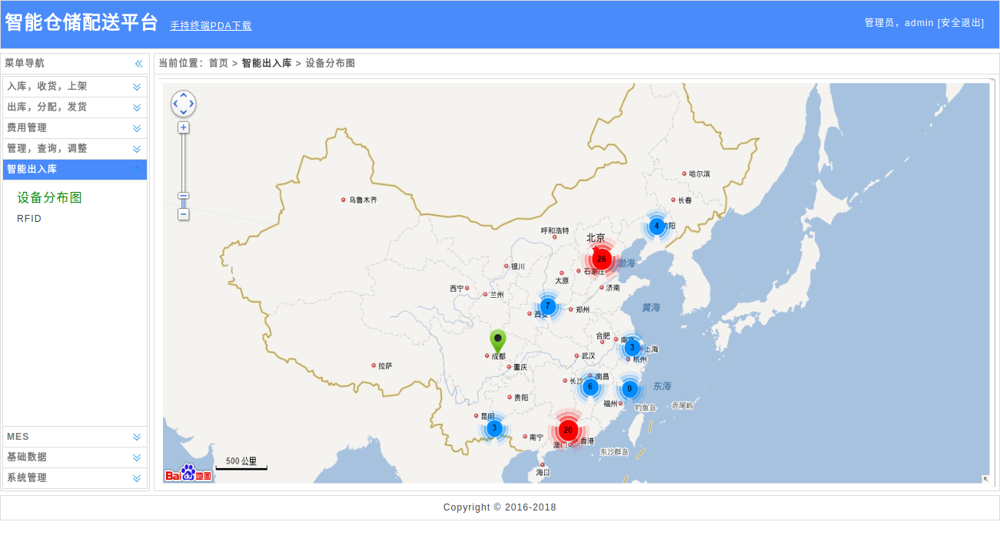
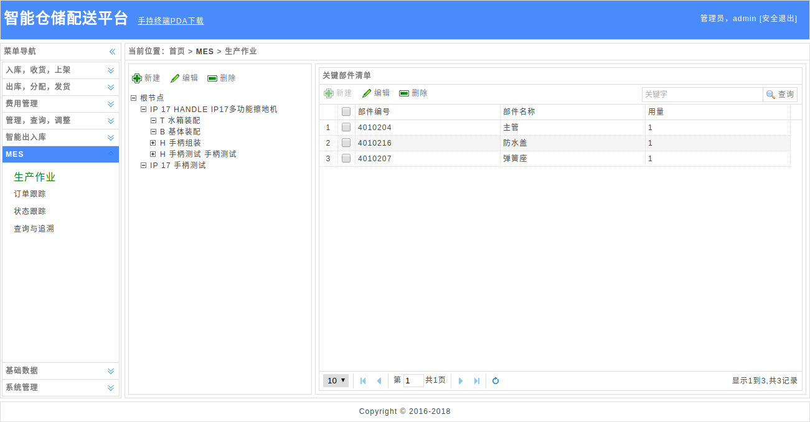
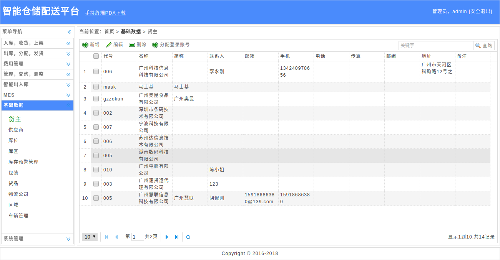
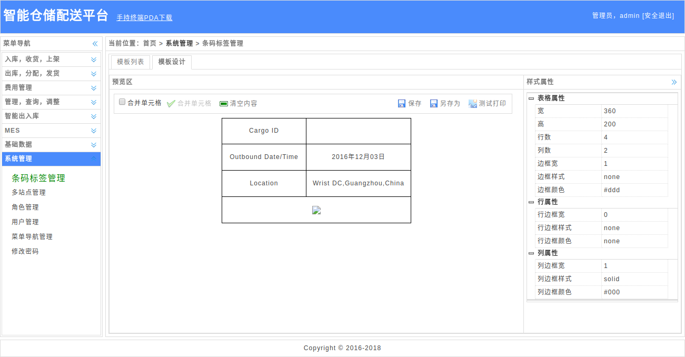

Wms（智能仓储配送一体化平台）

Wms为物流企业、工厂、电商平台等解决了客户、供应商、库位/库存、货品、分类、收货、上架、出库等业务的管理和维护。利用互联网+Wms，更加方便快捷。我们的Wms具有仓储与配送一体化功能，集成手持终端PDA，条码扫描、RFID+电子标签功能、订单Web打印、标签Web设计+生成+打印。

安装与部署：

1、克隆源码

选择一个剩余空间最大的磁盘，如E盘，分别新建三个文件夹Wms，Wms/Publish，Wms/Source，从github下载源码至Asset/Source目录，执行命令下载
git clone https://github.com/qq283335746/Wms.git

2、下载并安装sql server数据库以及管理工具

下载并安装SQL Server 2017 Express（sql server2005、sql server2008 r2等版本都行），下载地址：https://www.microsoft.com/zh-cn/sql-server/sql-server-downloads，下载并安装SSMS管理工具：https://docs.microsoft.com/zh-cn/sql/ssms/download-sql-server-management-studio-ssms?view=sql-server-2017

3、安装数据库

打开sql server管理工具，并附加TygaSoftAspnetDb、AssetDb数据库

4、下载并安装visual studio

https://visualstudio.microsoft.com/zh-hans/downloads/

5、使用visual studio打开解决方案文件，并运行源码、发布项目

6、运行，看到登录界面，登录账号：admin  admin123456

安装与部署参考：

[windows iis10 部署](./docs/Win10.md)

Wms（智能仓储配送一体化平台）技术点标签：

后端：webservice、wcf、linq、ado.net、sql server、三层架构

前端：jquery、easyui、ionic、cordova、barcode、RFID

移动端：android、ios

技术、业务、交流联系：qq:283335746！

Wms（智能仓储配送一体化平台）截图如下：

